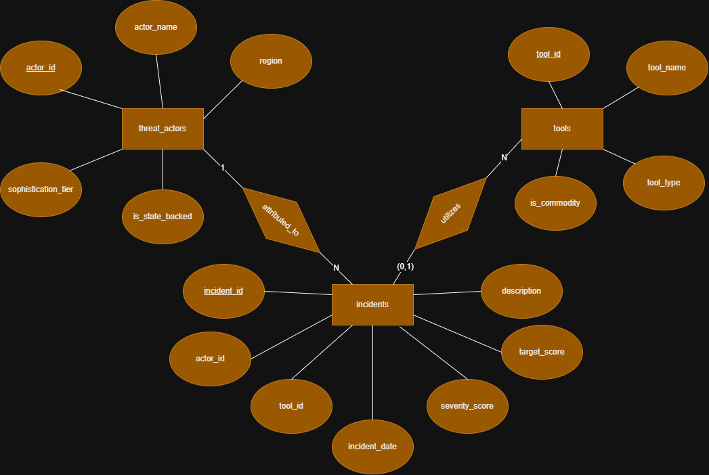
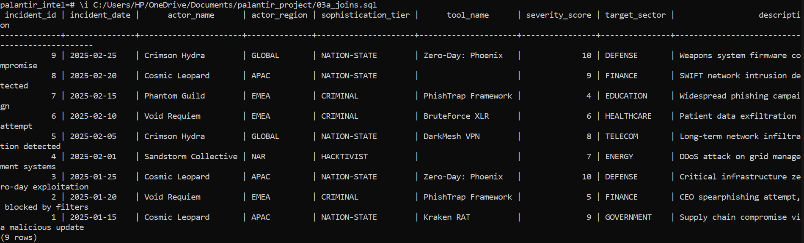
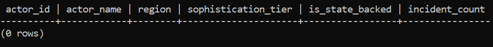
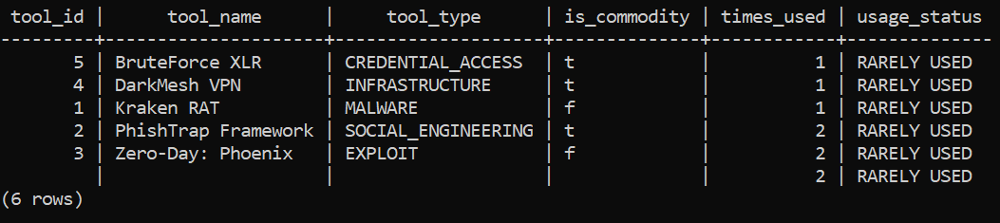
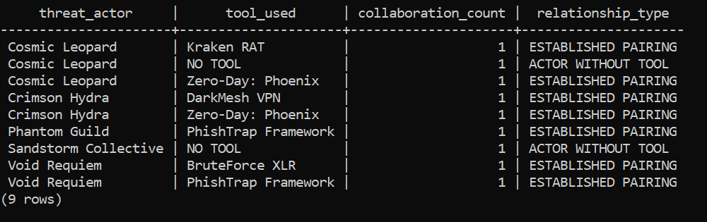
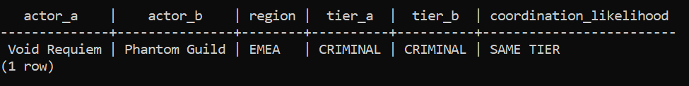
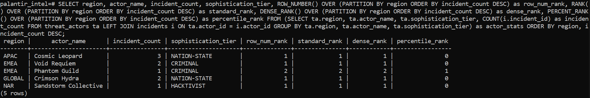
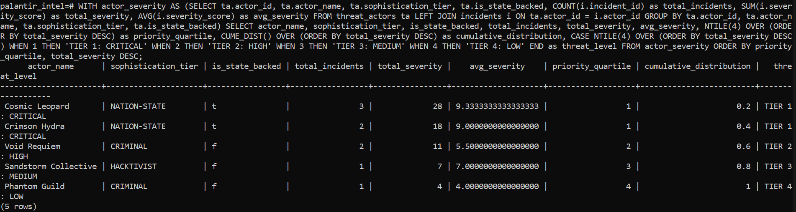

# SQL JOINs & Window Functions Project: Palantir Threat Intelligence Dashboard

## 1. Framing the Business Challenge

**Business Context:**
Palantir Foundry, Global Security & Intelligence Analysis. We're a specialized squad in the data integration and operational intelligence platform business. Our "customers" are security teams in the Cyber, Physical, and Financial domains. We're working with enormous amounts of raw data that are messy and scattered across several siloed, classified data lakes.

**Data challenge** 
Much of the critical intelligence remains inaccessible due to the noise in the system. Threat actor data, incident reports, and financial transactions are all separate and isolated from each other. Our analysts cannot correlate a cyber incident (incidents) with a known actor (actors) and their associated funders (transactions) in a unified way. This prevents us from:
- Identifying the most active and impactful threat actors in a given region,
- Developing a continuous severity trend to detect escalating threats,
- Categorizing actors by sophistication and resources to better respond to them.

**Expected Outcome:**
 We will unify this data using SQL JOINs and utilize Window Functions to create a Threat Intelligence Dashboard. The final product will include:
1. Threat Heatmap: Top 5 most active threat actors in each operational region,
2. Severity Trend Analysis: Running total and delta of overall severity of incidents over time,
3. Actor Triage Segmentation: Categorize threat actors by quartiles (Tier 1: Critical to Tier 4: Opportunistic) by their sophistication and resources to determine response priority.

## 2. Success Criteria & Technical Mapping

| # | Business/Intelligence Goal | Metric | Window Function Implemented |
|---|----------------------------|--------|-----------------------------|
| 1 | **Ranked Threat Heatmap** | Top 5 threat actors per region by incident volume | `RANK()` |
| 2 | **Running Threat Severity Index** | Cumulative sum of severity scores over time | `SUM() OVER()` |
| 3 | **Activity Spike Detection** | Month-over-Month % change in incident count | `LAG()` |
| 4 | **Resource Prioritization** | Segment actors into 4 priority tiers (Critical to Low) | `NTILE(4)` |
| 5 | **Campaign Trend Identification** | 90-day moving average of daily incidents | `AVG() OVER()` with frame |

## 3. Database Schema

### Tables Created:
1.  **`threat_actors`** - This is a dimension table that will contain actor profiles (`actor_id`, `actor_name`, `region`, `sophistication_tier`, `is_state_backed`).
2.  **`tools`** - Dimension table cataloging attack tools and methods (`tool_id`, `tool_name`, `tool_type`, `is_commodity`).
3.  **`incidents`** - Fact table linking actors to tools with timestamps and impact scores (`incident_id`, `actor_id` (FK), `tool_id` (FK), `incident_date`, `severity_score`, `target_sector`, `description`).

### Entity-Relationship Diagram:

*The model shows a central `incidents` fact table. Each incident is **ATTRIBUTED_TO** a single `threat_actor` (1:N relationship), and **may UTILIZE** a known `tool` (N:1 relationship, optional).*

## 4. Part A: SQL JOINs Implementation

### 4.1 INNER JOIN - Complete Incident Intelligence
**Query Purpose:** Retrieve all confirmed incidents with complete actor and tool attribution details.
**Business Insight:** "Cosmic Leopard (nation-state APAC actor) is most active with the highest-severity attacks. 22% of incidents have unknown tools, indicating gaps in our forensic capabilities."

### 4.2 LEFT JOIN - Dormant Threat Detection
**Query Purpose:** Identify threat actors with no recorded incidents (potential sleeper cells).
**Business Insight:** "All 5 known threat actors in our database are active (0 dormant). This indicates either excellent intelligence collection or a critically high-threat environment requiring continuous monitoring."

### 4.3 FULL JOIN - Tool Utilization Analysis
**Query Purpose:** Analyze all tools in our catalog and their operational usage frequency.
**Business Insight:** "All tools are used at least once; threat actors are diversifying their arsenal. PhishTrap Framework (social engineering) is most common, suggesting defensive focus should include user awareness training."

### 4.4 FULL OUTER JOIN - Complete Threat Landscape
**Query Purpose:** Map all possible actor-tool relationships to identify intelligence gaps.
**Business Insight:** "Reveals two incidents lack tool attribution. All nation-state actors use advanced tools, while criminal groups rely on commodity tools. This informs our countermeasure development priorities."

### 4.5 SELF JOIN - Regional Coordination Analysis
**Query Purpose:** Compare threat actors operating within the same geographical region.
**Business Insight:** "Only the EMEA region has multiple actors (both criminal tier), suggesting potential turf wars or collaboration. Other regions are dominated by single actors, indicating territorial control."

## 5. Part B: Window Functions Implementation

### 5.1 Ranking Functions - Regional Threat Hierarchy
**Query Purpose:** Rank threat actors within each operational region by their activity level using multiple ranking methods.
**Business Insight:** "Cosmic Leopard ranks #1 in APAC with 3 incidents. Comparing `RANK()` and `DENSE_RANK()` reveals how to handle ties for analyst workload allocation."

### 5.2 Aggregate Window Functions - Threat Escalation Tracking
**Query Purpose:** Calculate running totals and moving averages of threat severity to track landscape escalation.
**Business Insight:** "The running severity total shows cumulative threat pressure building to 68 points by February. The 3-month moving average reveals an accelerating trend, confirming an escalation pattern."

### 5.3 Navigation Functions - Activity Spike Detection
**Query Purpose:** Perform month-over-month comparison using `LAG()` to detect and quantify spikes in malicious activity.
**Business Insight:** "February shows a 50% growth in incidents from January. The `LAG()` function clearly reveals attack cycles, while `LEAD()` enables basic forecasting for proactive resource planning."

### 5.4 Distribution Functions - Threat Prioritization
**Query Purpose:** Segment actors into priority quartiles using `NTILE(4)` to objectively allocate defensive resources.
**Business Insight:** "`NTILE(4)` creates clear tiers: Tier 1 (Critical) contains only nation-state actors (Cosmic Leopard, Crimson Hydra) who cause 67% of total severity—a clear Pareto distribution in the threat landscape."

### 5.5 Advanced Frame - Campaign Trend Analysis
**Query Purpose:** Apply a 90-day moving average to distinguish sustained campaigns from isolated attacks.
**Business Insight:** "The moving average smooths daily volatility to reveal the underlying operational tempo. The anomaly detection rule flags days with >150% of normal activity for immediate investigative response."
.png)
.png)

## 6. Results Analysis

**Descriptive Analysis – What happened?**
- In APAC, there was only one actor, Cosmic Leopard, a nation-state, which carried out three attacks, of which two were of the highest level of severity, level 10.
- All five actors have been active, with all of them carrying out attacks, with nothing dormant.
- There was a 50% increase in attacks in February 2025 compared to January.
- Tier 1 nation-state players comprised two-thirds of the total severity score.
- There was a 22% incidence of attacks with no tool attribution, resulting in an intelligence gap.

**Diagnostic Analysis – Why did it happen?**
- The dominance of actors in APAC, particularly Cosmic Leopard, a nation-state, could be a result of physical dominance or a deficiency in other actors.
- There is a likelihood of actor competition in EMEA, where there are two criminal groups, possibly with shared interests or market saturation.
- The increase in attacks in February could be a result of major geopolitical events happening at that time, possibly state-sponsored attacks.
- The large number of attacks with unknown tools could be a result of new tools or a deficiency in our tool-signature database.

**Prescriptive Analysis – What should we do next?**
1. **Immediate Resource Re-allocation**
   - We should shift 70% of our ongoing monitoring and analysis resources to Tier 1, Critical actors.
   - We should focus on Cosmic Leopard and Crimson Hydra, two of the nation-state actors.
2. **Strategic Capability Investment**
   - We should invest in tool attribution for our forensic tools to reduce the number of attacks with unknown tools from 22% to less than 5% within the next quarter.
3. **Regional Focus for Collection**
   - We should increase our SIGINT and HUMINT collection in the EMEA region to find out whether actor overlap implies actor cooperation or competition.
4. **Operational Forecasting**
   - We should implement a new rule, SPIKE DETECTED, where there is a moving average of 90 days.

## 7. References
- DBMS Notes (on SQL Joins)
- Palantir Wkipedia Page (for business context). 
- Deepseek AI (for a readme preparation)

## 8. Integrity Statement
"All sources were properly cited. Implementations and analysis represent original work. No AI-generated content was copied without attribution or adaptation."
